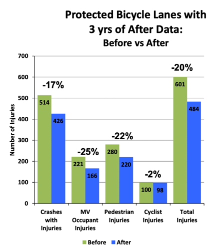
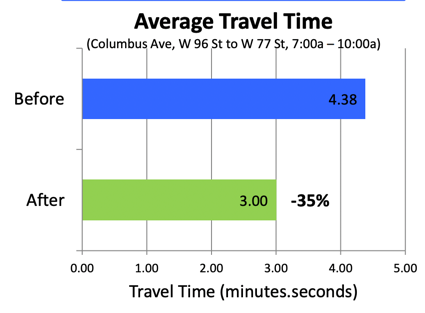
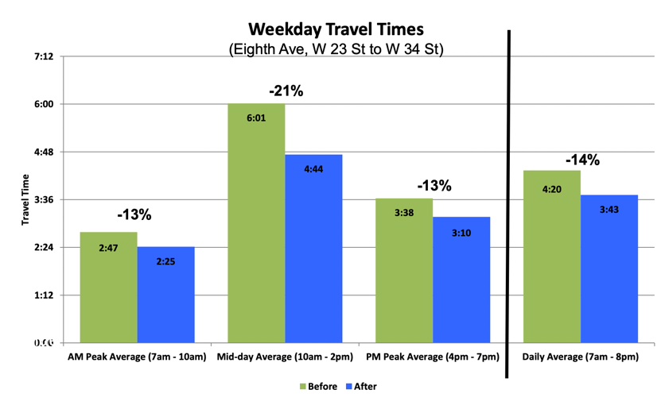

_Maintained by_ <a class="social-icon" href="https://instagram.com/bikesoma_nj" style="text-decoration:none"><i class="fab fa-instagram" title="Instagram"></i>BikeSOMa_NJ</a>

Bike and safe streets advocates have our work cut out for us. To help, here is a cheat sheet of useful resources showing
some of the many ways in which more biking improves our neighborhoods and cities.

# Research

## [Measuring the street](assets/research/2012-10-measuring-the-street.pdf), NYC DOT, 2012

### Improved safety for all

* protected bike lanes decrease injuries for _all_ road users
  * 8th Ave: 35% reduction
  * 9th Ave: 58% reduction

### Good for business

* 9th Ave protected bike lane
  * retail sales up 49% after 
  * rest of Manhattan up only 3%
* Union Square redesign (with protected bike lanes)
  * retail vacancies down 49%
   * rest of Manhattan vacancies down only 5%

## [NYC Protected Bike Lane Analysis](assets/research/2014-09-nyc-pbl-analysis.pdf), NYC DOT, 2014

### Improved safety for all

* 3 years of data shows reduction of injuries for all road users

  

* From 2001 to 2013, a 75% reduction in cycling risk

### Good for the environment

* Protected bike lanes increase ridership. Over a 6 month stretch ...

  | Route                     | Bike volume change %      |
  |:--------------------------|:-------------------------:|
  | 1st Ave                   | 160%                      |
  | 2nd Ave (2nd - 14th St)   | 49%                       |
  | 2nd Ave (23rd - 34th St)  | 60%                       |
  | 8th Ave                   | 9%                        |
  | 9th Ave                   | 65%                       |
  | Broadway (18th - 23rd St) | 28%                       |
  | Broadway (47th - 59th St) | 108%                      |
  | Columbus Ave              | 51%                       |

### Myth busting

* protected bike lanes _reduce_ car travel times

  

  

# In the news

#### No, Bike Lanes Don't Hurt Retail Business, CityLab, 2013

* [pdf](assets/news/2013-citylab-bikes-biz.pdf)
* [orignal link](https://www.bloomberg.com/news/articles/2013-09-10/no-bike-lanes-don-t-hurt-retail-business)

Covers research of Kyle Rowe at University of Washington. The conclusion is that bike lanes don't hurt
local business; may actually be good.

Key quote ...

> After the city removed 65th Street's 12 parking spots and striped a bike lane there instead, the sales index in the
> corridor exploded 400 percent.

#### The Complete Business Case for Converting Street Parking Into Bike Lanes, CityLab, 2015

* [pdf](assets/news/2015-city-lab-good-for-business.pdf)
* [original link](https://www.bloomberg.com/news/articles/2015-03-13/every-study-ever-conducted-on-the-impact-converting-street-parking-into-bike-lanes-has-on-businesses)

A review of 12 studies related to bike lanes and business. Key quote ...

> While cyclists tend to spend less per shopping trip than drivers, they also tend to make more trips, pumping more
> total money into the local economy over time.
